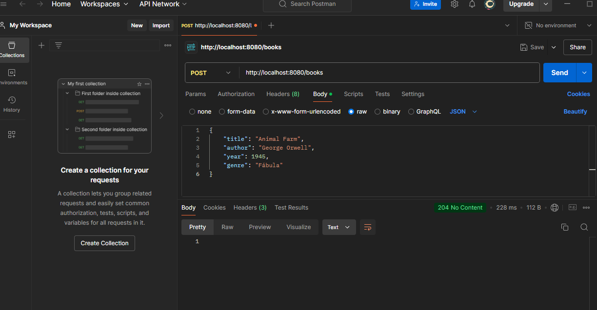
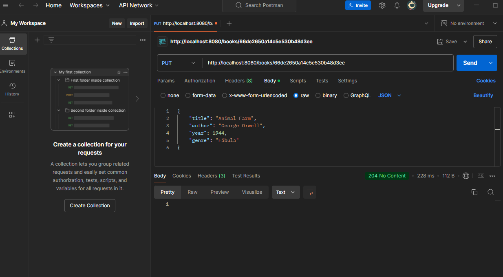
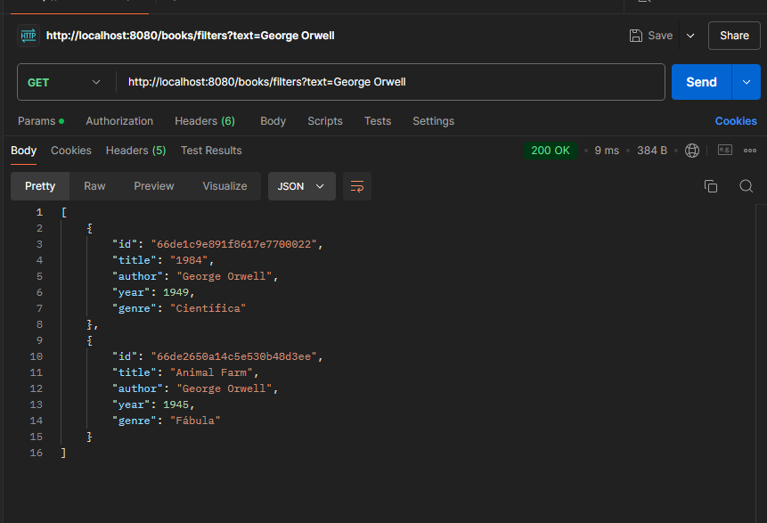
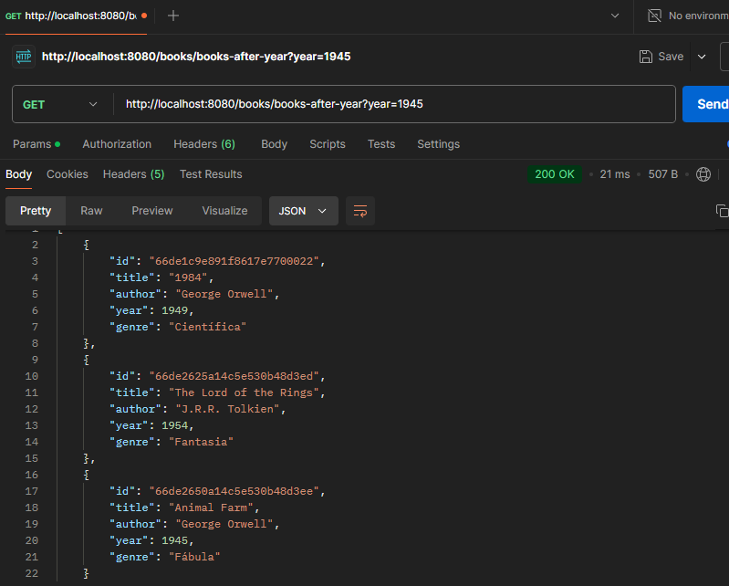

# Library Management System

This is a library management system developed in Java, using MongoDB as the database.

## Requirements

To use the system, make sure you have the following requirements installed:

- **Java Development Kit (JDK) 11 or higher**
- **Spring Tool Suite (STS) 4.24.0**
- **Apache Maven**
- **MongoDB 7.0.14**
- **Postman**

## Usage Steps

### 1. Configure the Database

Connect MongoDB to **localhost** on port **27017**. Then, create a database named library and a collection called books.

### 2. Clone and Run the Maven Project

1. Clone the repository with the following command:
   
   
´´´bash
   git clone https://github.com/rodrigueswallace/wallace-rodrigues-estudos.git

2. Navigate to the main project directory:
´´´bash
   cd wallace-rodrigues-estudos/spring-04-semana-05/

3. Compile and install the dependencies:
 
´´´bash
   mvn clean install

4. Run the project:
´´´´bash
   mvn exec:java

### 3. Test the System Using Postman

Now, open **Postman** to test the system.

- **Insert records**:
  - Example request to insert data into the database:
  
    

-  **Delete records**:
  - Example request to delete a record:
  
    

- **Update records**:
  - Example request to update data:
  
    

- **Query with filter**:
  - Example query with a custom filter:
  
    

- **Query with filter by year**:
  - Example query filtering by year:
  
    
