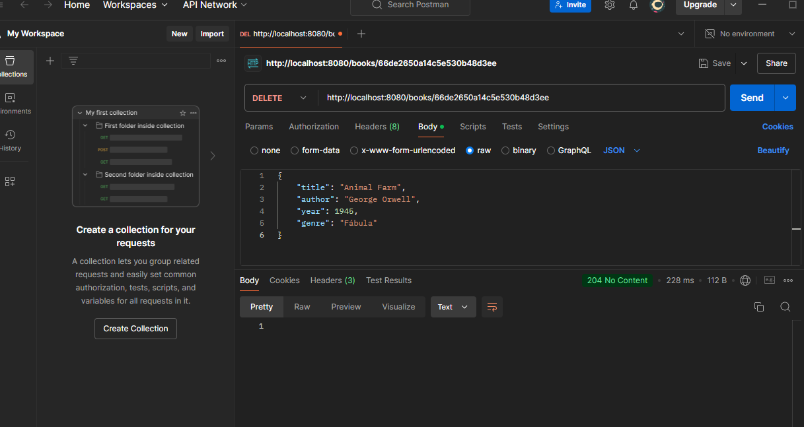

# Library Management System

This is a library management system developed in Java, using MongoDB as the database.

## Requirements

To use the system, make sure you have the following requirements installed:

- **Java Development Kit (JDK) 11 or higher**
- **Spring Tool Suite (STS) 4.24.0**
- **Apache Maven**
- **MongoDB 7.0.14**
- **Postman**

## Usage Steps

### 1. Configure the Database

Connect MongoDB to **localhost** on port **27017**. Then, create a database named library and a collection called books.

### 2. Clone and Run the Maven Project

1. Clone the repository with the following command:

```bash
   git clone https://github.com/rodrigueswallace/wallace-rodrigues-estudos.git
```

2. Navigate to the main project directory:

```bash
   cd wallace-rodrigues-estudos/spring-04-semana-05/
```

3. Compile and install the dependencies:

```bash
   mvn clean install
```

4. Run the project:

```bash
   mvn exec:java
```
5. Running a Spring Boot Application

To run the Spring Boot application, use the following command:

```bash
mvn spring-boot:run
```


### 3. API Endpoints

**Base URL**

```bash
http://localhost:8080/books
```
**Endpoints**

1. GET /books
   
   Returns all books in the collection.

   URL: /books
   HTTP Method: GET

   Response

```bash
[
 {
    "_id": "60c72b3f9f1b8a001c8e4b3b",
    "title": "1984",
    "author": "George Orwell",
    "year": 1949,
    "genre": "Dystopian"
  }
]
```

2. POST /books
   
Creates a new book in the collection.

URL: /books

HTTP Method: POST
Parameters:

- title: The title of the book.
- author: The author of the book.
- year: The year of publication.
- genre: The literary genre.

- Request Body Example:

```bash
{
    "_id": "60c72b3f9f1b8a001c8e4b3b",
    "title": "1984",
    "author": "George Orwell",
    "year": 1949,
    "genre": "Dystopian"
  }
```

3. PUT /books/{id}
   
Updates the information of an existing book.

URL: /books/{id}

HTTP Method: PUT

Parameters:

- title: New title of the book.
- author: New author of the book.
- year: New year of publication.
- genre: New literary genre.

- Request Body Example:

```bash
{
  "title": "Brave New World",
  "author": "Aldous Huxley",
  "year": 1932,
  "genre": "Dystopian"
}

```

4. DELETE /books/{id}
   
Deletes a book from the collection.

URL: /books/{id}
HTTP Method: DELETE


5. Filters to select collections based on the year

URL: /books/books-after-year?year={filter}

HTTP Method: GET

6. Filters to select specific collections
   
URL: /books/filters?text={filter}

HTTP Method: GET


### 4. Test the System Using Postman

Now, open **Postman** to test the system.

- **Insert records**:

  - Example request to insert data into the database:

    

- **Delete records**:
- Example request to delete a record:

  

- **Update records**:

  - Example request to update data:

    

- **Query with filter**:

  - Example query with a custom filter:

    

- **Query with filter by year**:

  - Example query filtering by year:

    
